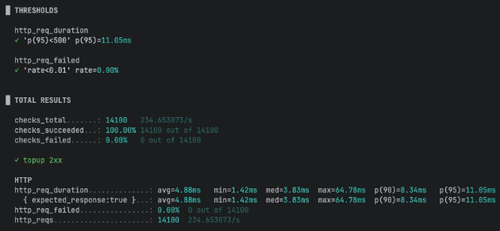
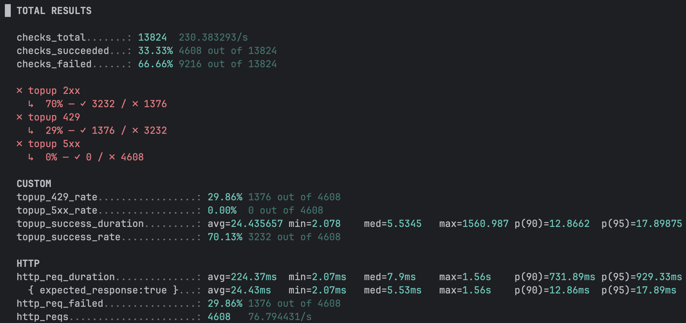
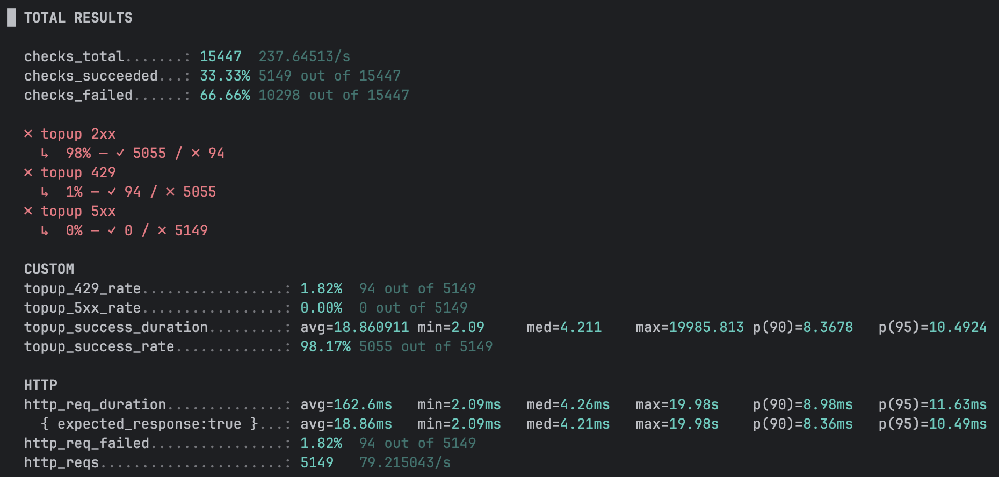
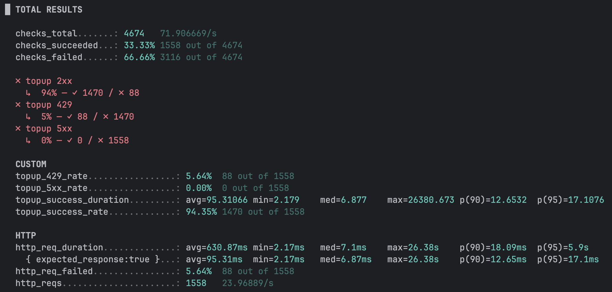

## 1) 프로젝트 목적

- 기존에는 JPA 비관락을 사용하여 wallet row를 직접 잠그는 방식으로 동시성을 제어하였다.
- 그러나 트래픽이 증가할 경우 DB row lock 대기 시간이 증가하고, 이에 따라 커넥션 점유 시간이 길어지면서 처리 지연이 발생하였다.
- 또한 락 정책을 애플리케이션 레벨에서 유연하게 제어하기 어려웠다.
- 이를 개선하기 위해 DB 내부 락이 아닌 Redis 분산락을 도입하여 DB 진입 이전 단계에서 동시 접근을 제어하도록 변경하였다.

## 2) 비관락 vs 분산락 비교

| 구분 | DB 비관락 | Redis 분산락 |
| --- | --- | --- |
| 제어 위치 | DB 내부 row lock | 애플리케이션 레벨 |
| 대기 정책 | 무제한 대기 | waitTime으로 제어 |
| 혼잡 표현 | DB 내부에서만 대기 | 429 등으로 명시적 표현 가능 |
| 멀티 인스턴스 | 동일 DB면 가능 | 동일 Redis 키로 명확한 제어 |

## 3) 설계 목표

분산락을 단순히 도입하는 것이 아니라, 다음을 목표로 설계하였다

- 기존 비즈니스 로직 변경 최소화
- AOP 기반 공통 분산락 컴포넌트화
- 혼잡을 500이 아닌 429로 명시적 표현
- 성공 요청 지연과 락 실패 비율을 분리 관측

## 4) 구현 방식

### 4.1 AOP + 어노테이션 기반 분산락

```java
@DistributedLock(key = "'wallet:' + #principal.id",
 waitTime = 200, 
 leaseTime = 3000)
```

- SpEL을 사용해 동적으로 락 키 생성
- 자원 단위: `wallet : {memberId}`
- Redisson tryLock(waitTime, leaseTime) 사용
- `@DistributedLock` 이 선언된 메서드는 `Propagation.REQUIRES_NEW` 옵션을 지정해 부모 트랜잭션의 유무와 관계없이 별도의 트랜잭션으로 동작

### 4.2 왜 AOP를 사용했는가?

- 기존의 코드 변경을 최소화
- 다른 도메인에도 재사용 가능
- waitTime,leaseTime을 커스텀 하게 지정
- 이를 통해 비즈니스 로직은 그대로 두고, 동시성 제어 정책만 교체 가능하도록 설계

### 4.3 DistributedLockAop.java

```java
@Aspect
@Component
@RequiredArgsConstructor
@Slf4j
public class DistributedLockAop {
    private static final String LOCK_PREFIX = "LOCK:";

    private final RedissonClient redissonClient;
    private final AopForTransaction aopForTransaction;

    @Around("@annotation(DistributedLock)")
    public Object lock(final ProceedingJoinPoint joinPoint) throws Throwable{
		  ...
    }
}
```

## 5) 부하테스트 결과(k6)

### 5.1 실험 환경

- 단일 wallet(memberId=1) 대상
- 50 VUs
- ramping-vus 시나리오
- 성공(2xx), 429, 5xx 분리 측정
- 성공 요청 지연과 전체 요청 지연 분리 관측

### 5.2 지표 결과

| **전략** | **성공률** | **429 비율** | **성공 p95** | **전체 p95** | **RPS** | **max 지연** |
| --- | --- | --- | --- | --- | --- | --- |
| 비관락 | 100% | 0% | ~11ms | ~11ms | ~234 | ~64ms |
| Redis (200ms) | ~70% | ~29% | ~17ms | ~0.9s | ~76 | ~1.5s |
| Redis (2000ms) | ~98% | ~1.6% | ~12ms | ~0.9s | ~88 | ~20s |
| Redis (3000ms) | ~94% | ~5.6% | ~17ms | ~5.9s | ~24 | ~26s |

### 5.3 결과 해석

1. 성공 요청 지연은 거의 차이가 없었다
    - 비관락

      

      비관락 k6 결과

    - Redis 분산락 적용 후에도 성공 요청의 p95는 12~17ms 수준
    - 즉, 분산락 자체가 정상 요청의 응답시간을 크게 약화시키지는 않았다.
2. waitTime이 짧을수록 혼잡을 빠르게 차단
    - 200ms설정시

      

      Redis (200ms) 설정시 k6 결과

    1. 성공률 하락 (70%)
    2. 429비율 증가 (29%)
3. waitTime을 늘리면 성공률은 올라가지만 tail latency가 증가
    - 2000ms 설정시

      

      Redis (2000ms) 설정시 k6 결과

        1. 성공률 증가(98%)
        2. 429비율 하락(1.6%)
        3. max latency급증 (20s)
    - 3000ms설정시

      

      Redis (3000ms) 설정시 k6 결과

        1. 성공률 하락(94%)
        2. 429비율 증가(5.6%)
        3. max latency증가(26s)
4. 비관락과의 구조적 차이
    - 비관락은 DB 내부에서 대기
    - 분산락은 애플리케이션 레벨에서 대기 또는 차단

## 6) 최종 결론

단일 자원(wallet=1)에 대한 극단적 경쟁 상황에서는 처리량(RPS)만 놓고 보면 DB 비관적 락이 더 높게 측정되었다.

하지만 Redis 분산락 도입의 목적은 단순한 속도 향상이 아니였다.

이번 실험을 통해 확인한 것은 다음과 같다

- 분산락은 성능을 올리는 도구가 아니라 혼잡 상황에서의 정책 제어 도구에 가깝다.
- waitTime을 줄이면 애플리케이션 레벨에서 빠르게 실패(429)하며 DB를 보호할 수 있다.
- waitTime을 늘리면 성공률은 올라가지만 tail latency가 급격히 증가한다.
- 결국 문제는 “얼마나 빠르게 처리할 것인가”가 아니라 “어디에서 기다리게 할 것인가”에 대한 선택이었다.

이번 작업을 통해 동시성 제어의 책임을 DB내부에서 애플리케이션 레벨로 이동시켰고, AOP기반 설계를 통해 비즈니스 로직 수정 없이 정책을 교체할 수 있는 구조적 유연성을 확보했다.